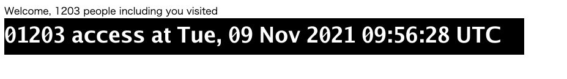

# modern-access-counter
for tset https://github.com/mashiike/setddblock


## build

set envs 
```console
export TFSTATE_BUCKET=<tfstate remote s3 bucket name>
export TF_VAR_data_bucket=<counter file s3 bucket name>
export DDB_LOCK_URL=ddb://setddblock/modern-access-counter
export S3_OBJECT_PATH=counter.json
```

following commands:
```console
$ make terraform/plan
$ make terraform/apply-iam-only
$ make deploy-dry-run
$ make deploy
$ make terraform/apply
```

## load test 

```console
$ make reset-counter
$ make load-test
```
## LICENSE

MIT
